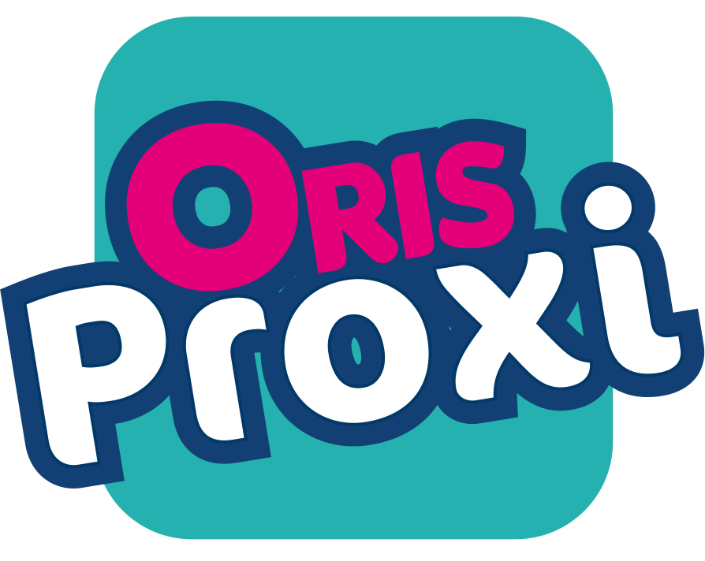
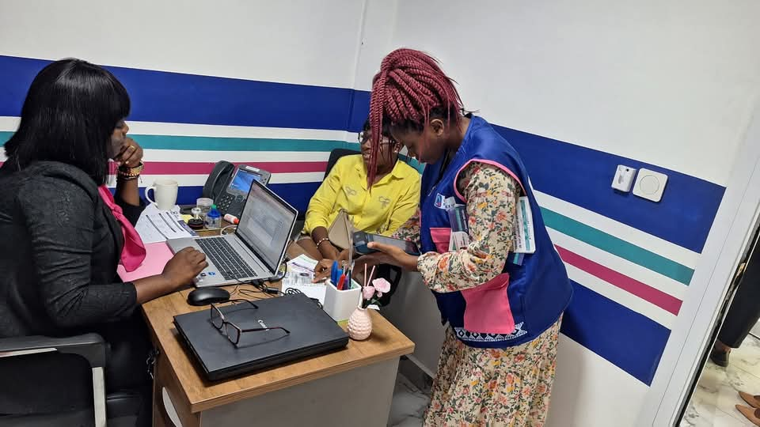

Oris Finance S.A

### Découvrez nos différents comptes

Qu’importe ta classe sociale, fait le choix du compte qui te convient et bénéficie de l’accompagnement d’un expert...

COMPTES DE DÉPÔTS COMPTES ORGANISATIONS COMPTES COURANTS COMPTES ENTREPRISES COMPTES À TERME

COMPTES DE DÉPÔTS

### PERSONNE PHYSIQUE / ORIS INVEST / ORIS SCHOOL

-   Titulaires : personnes physiques
    
-   Documents : CNI, 2 photos 4×4, plan de localisation du domicile
    
-   Numéro d’identifiant unique
    
-   Minimum à l’ouverture (versement initial) :
    
    -   **5 000 FCFA** (Oris Invest)
        
    -   **10 000 FCFA** (Oris School)
        

[Créer le compte](/ouvrir-un-compte/)

COMPTES DE DÉPÔTS

### Oris Proxi

-   Minimum à l’ouverture : **1 000 FCFA**
    
-   Titulaires : personnes physiques
    
-   Documents : CNI, 2 photos 4×4, plan de localisation
    
-   Numéro d’identifiant unique
    

[Créer le compte](/ouvrir-un-compte/)

COMPTES DE DÉPÔTS

### COMPTES ORGANISATIONS (ASSOCIATIONS / ONG / GIC / COOPÉRATIVES)

-   Demande sur papier en-tête signé du mandataire légal
    
-   CNI ou récépissé valide du (des) signataire(s)
    
-   N° d’identifiant unique (NIU)
    
-   2 photos 4×4 du (des) signataire(s)
    
-   Statuts et règlements intérieurs
    
-   PV de l’AG désignant les membres du bureau
    
-   Certificats de conformité PV
    
-   Certificat d’inscription ou d’immatriculation
    
-   Modifications statutaires publiées
    
-   Attestation de non redevance fiscale
    
-   Plan de localisation du siège
    
-   **Minimum à l’ouverture : 33 500 FCFA**
    

[Créer le compte](/ouvrir-un-compte/)

COMPTES COURANTS

### PARTICULIER NON SALARIÉ

-   Minimum : **53 500 FCFA**
    
-   Documents : CNI, 2 photos 4×4, localisation domicile + activité
    
-   Chéquier 25 ou 50 feuilles
    
-   Numéro d’identifiant unique
    

[Créer le compte](/ouvrir-un-compte/)

COMPTES COURANTS

### SALARIÉS (PUBLIC / PRIVÉ)

-   Minimum : premier virement salaire
    
-   Frais d’ouverture : **Gratuit**
    
-   Abonnement à des services bancaires numériques
    
-   Documents : CNI, 2 photos 4×4, plan localisation + contrat ou bulletin de salaire
    
-   Chéquier 25 ou 50 feuilles
    
-   Numéro d’identifiant unique
    

[Créer le compte](/ouvrir-un-compte/)

COMPTES ENTREPRISES

### ÉTABLISSEMENT / SARL / S.A

-   Demande d’ouverture sur papier en-tête
    
-   CNI ou récépissé valide du (des) signataire(s)
    
-   NIU
    
-   2 photos 4×4
    
-   Statuts et documents de création
    
-   Certificat d’immatriculation
    
-   Attestation de non redevance fiscale
    
-   Plan de localisation
    
-   **Minimum à l’ouverture : 104 500 FCFA**
    

[Créer le compte](/ouvrir-un-compte/)

COMPTES À TERME

### LES BONS DE CAISSE

-   Titulaires : personnes physiques (client ou non)
    
-   Frais d’ouverture : **Gratuit**
    
-   Minimum de souscription : **5 000 000 FCFA**
    
-   Taux de rémunération : Négociable
    
-   Paiement des intérêts : à l’échéance
    
-   Durée : 6 mois minimum (renouvelable)
    

[Créer le compte](/ouvrir-un-compte/)

COMPTES À TERME

### DÉPÔT À TERME

-   Titulaires : personnes morales (entreprises et associations)
    
-   Frais d’ouverture : **Gratuit**
    
-   Minimum de souscription : **10 000 000 FCFA**
    
-   Taux de rémunération : Négociable
    
-   Paiement des intérêts : à l’échéance
    
-   Durée : 1 an minimum (renouvelable)
    

[Créer le compte](/ouvrir-un-compte/)

ORIS FINANCE S.A vous ouvre ses portes.

### Faites le premier pas vers une expérience financière sur mesure, fiable et accessible à tous.

[Contactez-nous](/contacts)
